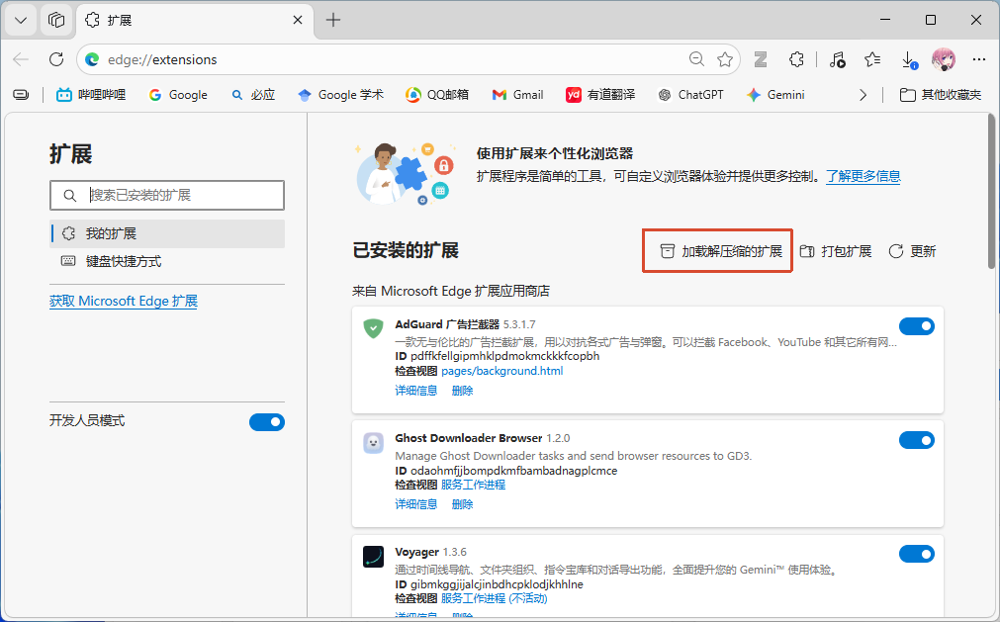
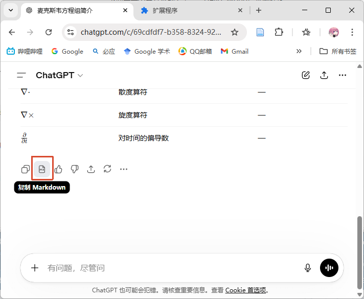

# ChatGPT Markdown Copier

<p align="center">
  
  
</p>

在 ChatGPT 官方“复制回复”按钮旁增加“复制 Markdown”按钮，可以复制正确的数学公式。
> 原版复制的数学公式界定符有问题

**已验证内容:**

- [x] 数学公式
- [x] 代码段
- [x] 表格
- [x] 链接


## 安装与使用


### 安装步骤（Chrome）

1. 在 [Releases](https://github.com/Huffer342-WSH/ChatGPT-Markdown-Copier/releases) 下载 `chatgpt-markdown-copier-xxx-chrome.zip`
2. 解压 zip 到本地目录
3. 打开 Chrome 扩展页面：`chrome://extensions/`
4. 打开右上角“开发者模式”
5. 点击“加载已解压的扩展程序”，选择解压后的目录



### 使用方式

在 ChatGPT 恢复的下下面会多一个按钮，点击按钮可复制当前回复为 Markdown。




## 开发

### 快速开始

```bash
pnpm install
pnpm run dev
```

> 说明：`pnpm run dev` 启动的浏览器访问ChatGPT会一直触发机器人检查，建议在日常浏览器通过“加载已解压的扩展程序”进行调试。

### 常用命令

```bash
pnpm run compile   # TypeScript 类型检查
pnpm run build     # 生产构建（修改代码后必跑）
pnpm run zip       # 打包发布产物
```

### 项目结构

- `entrypoints/`：扩展入口（内容脚本、背景脚本）
- `lib/`：核心复用逻辑（Markdown 处理、内容脚本 UI）
- `public/`：静态资源（图标等）
- `docs/architecture.md`：架构与模块说明

架构细节见：[docs/architecture.md](./docs/architecture.md)
