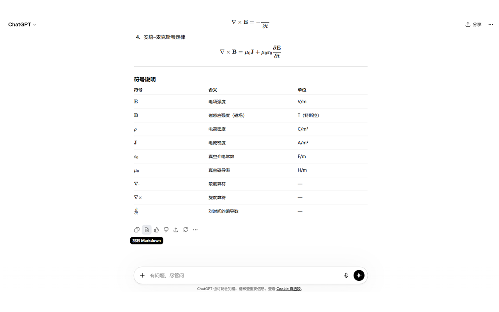
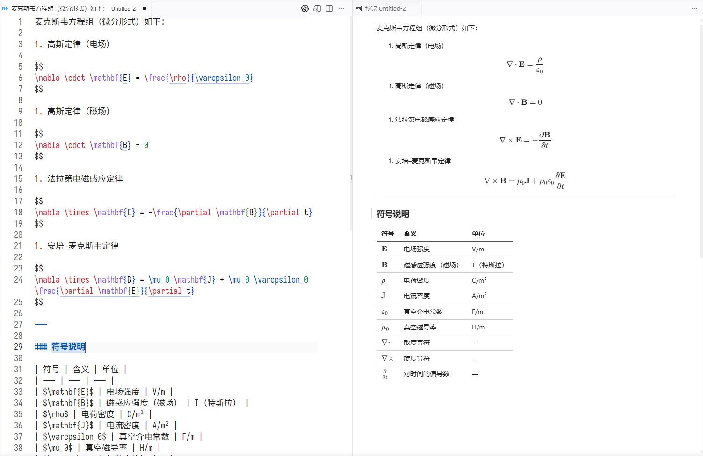

# ChatGPT Markdown Copier

<p align="center">
  
  
</p>

一个面向 `https://chatgpt.com/*` 的 Chrome 扩展。
在 ChatGPT 官方“复制回复”按钮旁增加“复制 Markdown”按钮。

ChatGPT原版的“复制回复”得到的markdown文本数学公式格式不正确（缺少界定符`$`）
> 实际上chatgpt在复制到剪贴板的时候原本是有带latex风格界定符\[\]和\(\)的文本的，但是给处理掉了，在开发者工具sources中搜索"No conversation turn found for clipboard copy"可以定位到处理字符串的函数


## 功能特性

- 在 ChatGPT 回复操作区插入 `复制 Markdown` 按钮
- 直接基于 DOM 生成 Markdown，重点修复数学公式复制格式
- 支持按钮状态反馈与仿原版 tooltip 交互

## 架构文档

- 项目结构与实现说明见：[docs/architecture.md](./docs/architecture.md)

## 开发与构建

```bash
pnpm install
pnpm run dev  # 打开的浏览器会卡机器人检查，用日常浏览器手动“加载已解压的扩展程序”就行
```

常用命令：

```bash
pnpm run compile   # TypeScript 类型检查
pnpm run build     # 生产构建
pnpm run zip       # 打包发布产物
```

## 当前已验证的情况

- [x] 数学公式
- [x] 代码段
- [x] 表格
- [x] 链接
