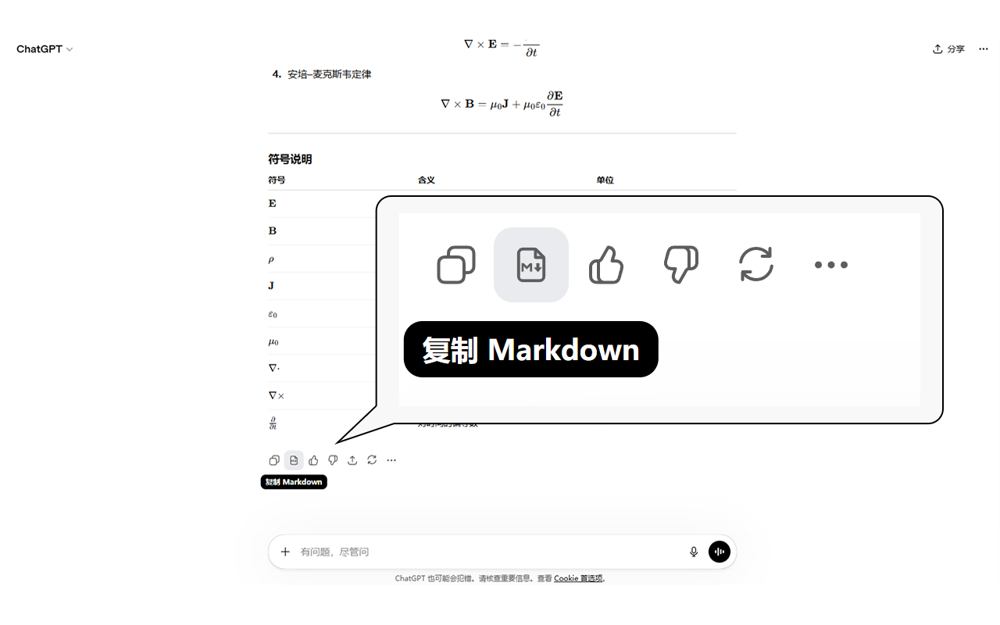
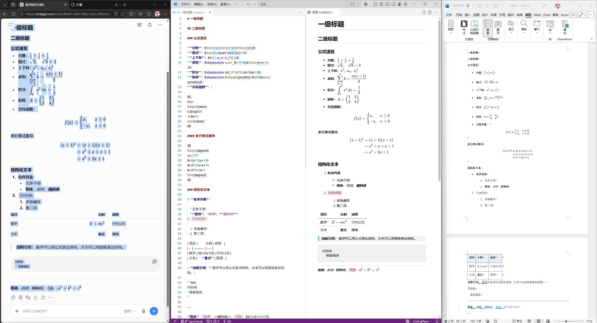
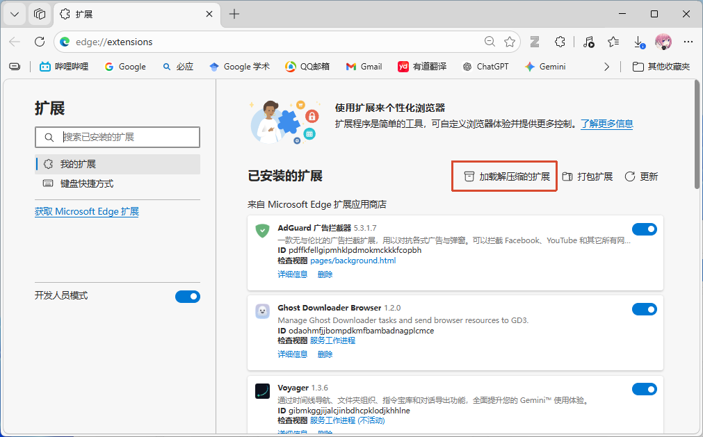
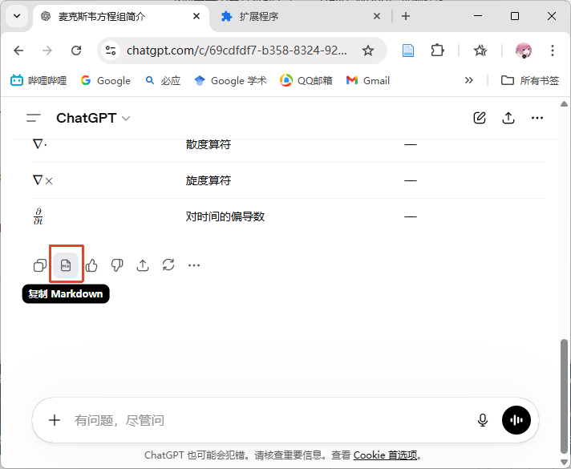

# ChatGPT Markdown Copier

<p align="center">
  
  
</p>

将 ChatGPT 整条回复或选中内容复制为 Markdown，保留公式、代码、列表、表格和链接。选区复制同时提供富文本，便于向 Word 粘贴公式与带边框的表格。

**[从 Microsoft Edge 扩展商店安装](https://microsoftedge.microsoft.com/addons/detail/chatgpt-markdown-%E5%A4%8D%E5%88%B6%E5%8A%A9%E6%89%8B/nmeicoenglafaabhmmnkhokbalkcmjjh)**

[下载离线安装包](https://github.com/Huffer342-WSH/ChatGPT-Markdown-Copier/releases)

## 功能

- **整条回复复制**：提供“复制回复”和“复制 Markdown”两个按钮。前者保留官方输出，后者修复官方输出中的markdown错误。
- **选区复制**：在网页上选中复制，也能提供符合markdown格式的文本，兼容列表、表格、公式、加粗等等

> 如果发现有不支持的功能请提 Issue

## 演示视频

https://github.com/user-attachments/assets/164712de-a32e-4c12-b6e7-71b160b521c3

<video controls width="600">
  <source src="./assets/copy-demo.mp4" type="video/mp4">
  您的浏览器不支持 video 标签。
</video>

[观看功能演示（MP4）](./assets/copy-demo.mp4)

## 安装与使用

### Edge 商店安装

打开 [Microsoft Edge 扩展商店页面](https://microsoftedge.microsoft.com/addons/detail/chatgpt-markdown-%E5%A4%8D%E5%88%B6%E5%8A%A9%E6%89%8B/nmeicoenglafaabhmmnkhokbalkcmjjh)

### 离线安装（Chrome / Edge）

1. 在 [Releases](https://github.com/Huffer342-WSH/ChatGPT-Markdown-Copier/releases) 下载 `chatgpt-markdown-copier-xxx-chrome.zip`
2. 解压 zip 到本地目录
3. Chrome 打开 `chrome://extensions/`；Edge 打开 `edge://extensions/`
4. 打开右上角“开发者模式”
5. 点击“加载已解压的扩展程序”，选择解压后的目录



### 使用

安装好插件后，可以看回复下方多了一个按钮，使用该按钮即可。



## 复制原理

**整条回复**：隐藏真正的官方按钮，保留它的事件处理器，显示两个独立按钮。原样复制直接触发官方按钮；Markdown 复制通过页面主环境临时接管官方剪贴板写入，修改文本参数后交给浏览器。因此不再从整条回复的 HTML 反推 Markdown，也不需要读取系统剪贴板。

> 在以前的版本里，是通过HTML转Markdown实现的，但是现在官方的复制结果以及很符合markdown标准，所以改为在官方的基础上修正。

**选区复制**：监听 `copy` 事件，用 `Selection` / `Range` 克隆选区，在副本中恢复必要的格式上下文并序列化。`text/plain` 写入 Markdown，`text/html` 写入带 MathML 公式和表格样式的富文本。

实现细节见 [架构说明](./docs/architecture.md)。

## Issue 提交规范

为便于定位“复制 Markdown”相关问题，请尽量使用仓库内的 `Bug 反馈（复制结果异常）` Issue 模板，并提供以下信息：

1. ChatGPT 回复 HTML
2. 问题截图
3. 实际复制出的结果

如果可以的话把有问题的聊天分享给我

### 如何提供 HTML

1. 通过开发者工具选中回复元素，执行“复制元素（Copy element）”，将片段粘贴到 Issue。
2. 保留与问题相关的最小片段，例如公式、列表或表格及其外层正文容器，移除账号信息和无关聊天内容。

## 开发

### 快速开始

```bash
pnpm install
pnpm run dev
```

> 说明：`pnpm run dev` 启动的浏览器访问ChatGPT会一直触发机器人检查，建议在日常浏览器通过“加载已解压的扩展程序”进行调试。

### 使用日常 Edge 调试

在项目根目录创建 `web-ext.config.ts`（已被 Git 忽略）：

```ts
import { defineWebExtConfig } from 'wxt';

export default defineWebExtConfig({
  // 手动使用已登录的浏览器，不自动打开开发浏览器。
  disabled: true,
});
```

运行 `pnpm dev:edge`，保持终端运行。在 `edge://extensions/` 开启开发人员模式，
通过“加载解压缩的扩展”选择项目的 `.output/edge-mv3-dev` 目录。
若已安装正式版，请先禁用正式版，避免重复注入按钮。

若开发服务已停止，可运行 `pnpm build:edge:dev` 单次更新此目录，然后重新加载扩展并刷新页面。
`pnpm build` 只更新 `.output/chrome-mv3`，不会更新 Edge 开发目录；`pnpm build:edge` 则输出到 `.output/edge-mv3`。

打开 ChatGPT 页面，按 `F12`，在 Sources 的 Content scripts 中设置断点，
在 Console 中搜索 `[MD-COPY]` 查看错误日志。保存代码后开发服务会重新构建；
如果页面未更新，请重新加载扩展并刷新页面。内容脚本更新可能刷新页面，建议使用已完成的会话调试。

### 检查与打包

```bash
pnpm run compile   # TypeScript 类型检查
pnpm run test      # DOM 与选区复制回归测试
pnpm test:watch    # 文件变化后自动重跑相关测试
pnpm test:ci       # CI 单次测试
pnpm run build     # 生产构建（修改代码后必跑）
pnpm run zip       # 打包发布产物
```

### 项目结构

- `entrypoints/`：扩展入口（内容脚本、背景脚本）
- `lib/`：核心复用逻辑（Markdown 处理、内容脚本 UI）
- `public/`：静态资源（图标等）
- `tests/`：回归测试、真实 DOM 精简样本及本地 Word 复制诊断页
- `docs/architecture.md`：架构与模块说明
